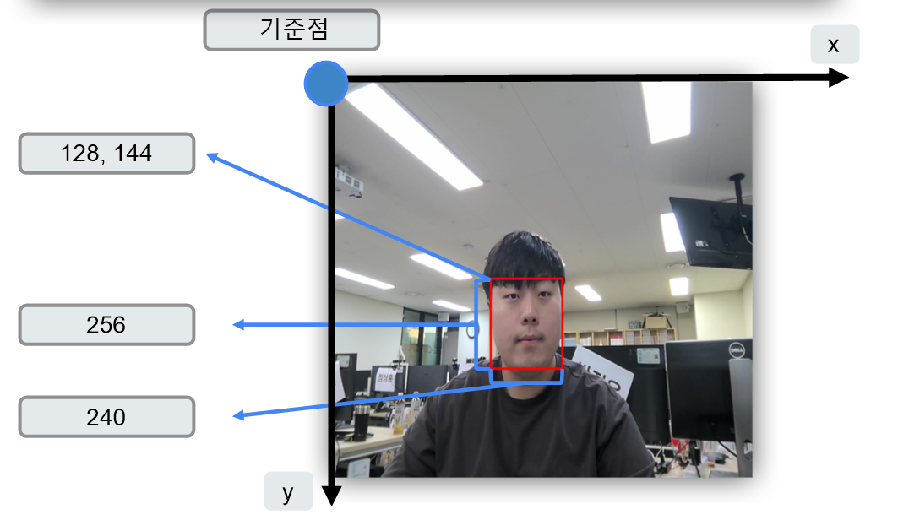
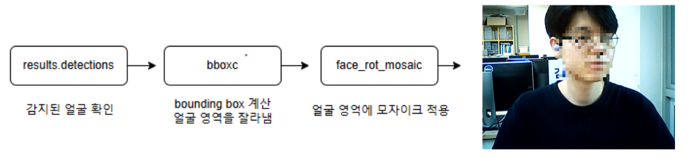

# 🌟 스마트 도어가드 프로젝트

스마트 도어가드는 1인 가구의 증가와 주거 침입 범죄의 증가에 대응하기 위해 설계된 실시간 얼굴 감지 및 알림 시스템입니다. 이 프로젝트는 **Python**, **OpenCV**, **Mediapipe**, **Kakao API**, **MariaDB** 및 **QT UI**를 활용하였습니다.

## 📋 **프로젝트 개요**
- **프로젝트명**: 스마트 도어가드
- **수행 기간**: 2024.09.02 ~ 2024.09.06
- **개발 목표**:
  - 실시간으로 주거 공간의 안전 상태를 모니터링.
  - 얼굴 및 객체 감지를 통한 이상 상황 알림.
  - 카카오톡 API를 활용한 알림 전송.
  - 데이터베이스 및 웹 UI를 통한 감지된 데이터 관리.


## 🛠️ **기술 스택**
| 기술                | 설명                                  |
|---------------------|---------------------------------------|
| **Python**          | 주요 프로그래밍 언어.                |
| **OpenCV**          | 이미지 처리 및 모자이크 효과 구현.    |
| **Mediapipe**       | 실시간 얼굴 감지.                    |
| **MariaDB**         | 데이터베이스 관리.                   |
| **Kakao API**       | 카카오톡 알림 전송.                  |
| **QT**              | GUI 기반 사용자 인터페이스 구현.     |

## 📂 **디렉토리 구조**

```plaintext
📁 스마트 도어가드
├── 📂 API                  # API 호출 및 알림 전송
│   ├── execute_api.py      # 새 이미지 생성 확인 및 카카오톡 호출
│   ├── send_message.py     # 카카오 API 메시지 전송
│   ├── set_json.py         # OAuth 인증 데이터 관리
├── 📂 이미지 처리
│   ├── image_processing.py # 얼굴 감지 및 모자이크 처리
│   ├── camera.py           # 카메라 스트림 처리
├── 📂 데이터베이스
│   ├── database.py         # MariaDB 초기화 및 이미지 저장
├── 📂 GUI
│   ├── gui.py              # QT 기반 사용자 인터페이스
├── main.py                 # 전체 시스템 실행 진입점
```

## 🔍 **주요 기능**
### 1️⃣ **얼굴 감지 및 모자이크 처리**
- **Mediapipe**를 활용해 실시간 얼굴 감지.
- 감지된 얼굴 영역에 모자이크 효과 적용.
- 원본 이미지는 데이터베이스에 저장되며, 필요 시 조회 가능.

**<얼굴 감지하는 기준점>**


<br>

**<제공된 얼굴 좌표에 모자이크 처리>**


### 2️⃣ **데이터 저장 및 관리**
- **로컬 저장**: 감지된 이미지를 PNG 파일로 로컬에 저장.
- **데이터베이스**: 감지 시간, 파일 이름, 이미지 데이터를 MariaDB에 저장.
- **이미지 관리**: DB 및 로컬 저장소의 모든 데이터를 삭제하는 기능 제공.

**<실시간으로 DB 저장 및 웹사이트에서 확인 가능>**


### 3️⃣ **카카오톡 알림 전송**
- 새로운 이미지가 생성되면 카카오톡 메시지 전송.
- Python의 `requests` 모듈로 API 호출 및 인증.

### 4️⃣ **GUI 기반 사용자 인터페이스**
- **촬영 시작/중지**: 얼굴 감지를 시작/중지.
- **모자이크 효과**: ON/OFF 전환.
- **데이터 삭제**: 로컬 및 DB의 모든 데이터를 삭제.
- **실시간 스트림**: 얼굴 감지 결과를 GUI에 표시.


**<감지되면 Kakao API에 의해 전송 & QT UI>**


## 📸 **시연영상**

### [감지 시 얼굴 표시](https://drive.google.com/file/d/1c4sSM_GC_fltZvzBOZGKgdaTEfZdgICl/view?usp=sharing)

### [모자이크 및 DB전송](https://drive.google.com/file/d/1r7dC-VoFq5t1tZqU8Nlu8E_lMZCjkBt7/view?usp=sharing)